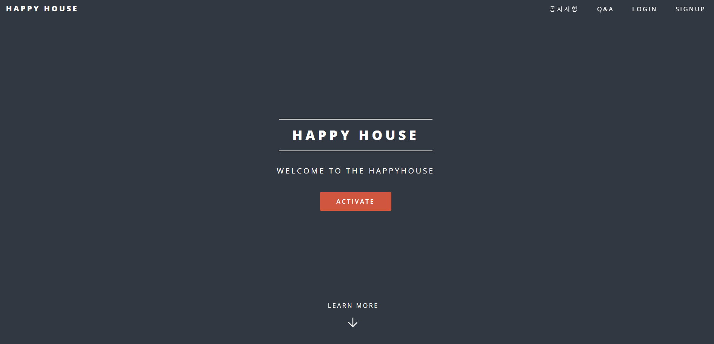

# Framework: Vue 관통 프로젝트

## 프로젝트명

---

Happy House Project (2022.05.18)

## Team Member

---

[박기윤](https://github.com/yoonArchive)

[어정윤](https://github.com/jeongyuneo)

## 기능 요구사항

---

1. 기본 기능

    ```
    - QnA 목록
    	- 가장 최근 작성된 질문이 먼저 보이도록 출력
    	- 질문 등록
    	- 검색 기능(제목, 내용, 작성자)
    - QnA 조회
    	- 질문 상세 조회 및 답변 조회
    	- 질문 수정/삭제
    	- 답변 등록
    		- 답변 미등록 시 질문 상태 '답변예정'/답변 등록 시 질문 상태 '답변완료'
    ```

2. 심화 기능

    ```
    - 공지사항 목록
    	- 가장 최근 작성된 공지사항이 먼저 보이도록 출력
    	- 공지사항 등록
    - 공지사항 조회
    	- 공지사항 상세 조회
    	- 공지사항 수정/삭제
    ```


## 기능 상세 및 실행 화면

---

### 0. 메인 화면



### 1. QnA

- 목록

  

- 등록
    - 내용 입력

      

    - 초기화

      

    - 빈칸 있을 시 등록 안됨

      

    - 등록 완료 시

      

      

- 조회

  


- 수정
    - 내용 입력

      

    - 수정 완료 시

      

      

- 삭제

  

  

- 검색
    - 제목으로 검색

      

    - 작성자로 검색

      

    - 내용으로 검색

      

- 댓글

  

  


### 2. 공지사항

- 목록

  

- 등록
    - 내용 입력

      

    - 등록 성공 시

      

      

- 조회

  

- 수정
    - 내용 입력

      

    - 초기화

      

    - 빈칸 있을 시 수정 안됨

      

    - 수정 성공 시

      

      

- 삭제

  

  


### 3. 로그인 및 회원가입

- 로그인

  

- 회원가입

  


## DB 세팅

---

- qna.sql

    ```sql
    create table question(
    	questionId int auto_increment primary key,
      title varchar(100) not null,
      content varchar(10000) not null,
      author varchar(10) not null,
      createDate varchar(20) not null,
      status varchar(10) not null
    );
    
    create table answer(
    	answerId int auto_increment primary key,
    	author varchar(10) not null,
      content varchar(10000) not null,
      createDate varchar(20) not null,
      questionId int,
      constraint fk_qna foreign key (questionId) references question (questionId)
      on delete cascade on update cascade
    );
    ```

- notice.sql

    ```sql
    create table notice(
    	noticeId int auto_increment primary key,
      title varchar(100) not null,
      content varchar(10000) not null,
      author varchar(10) not null,
    	category varchar(20) not null,
      createDate varchar(20) not null
    );
    ```