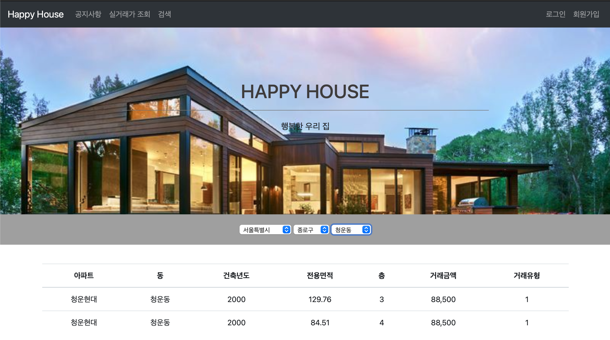

# Framework:Spring 관통 프로젝트

## 🌟 프로젝트명

---

Happy House Project (2022.05.02)

## 👭 Team Member

---

👩‍🦰 [박기윤](https://github.com/yoonArchive)

👱‍♀️ [어정윤](https://github.com/jeongyuneo)

## ✏️ 기능 요구사항

---

1. 유저 관련 기능

    ```
    - 회원 가입
    	- 해당 아이디가 이미 존재할 경우 회원가입 실패
    	- 비밀번호 일치하지 않을 경우 alert
    - 로그인/ 로그아웃
    	- 로그인 실패 시 아아디/비밀번호 확인 요청 alert
    	- 로그인 성공 시 로그인 성공 alert + 헤더 변경
    	- 로그아웃 시 헤더 변경
    - 비밀번호 찾기
    	- 아이디, 이름, 연락처를 통해 비밀번호 찾기
    - 회원 정보 조회
    	- 현재 로그인 되어있는 회원의 정보 조회
    - 회원 정보 수정
    	- 회원정보 수정 버튼 클릭 시 비밀번호/이름/이메일/연락처 input box 활성화
    	- 수정 후 수정 완료 버튼 클릭 시 해당 정보로 DB 갱신
    - 회원 탈퇴
    	- confirm창을 통해 탈퇴 여부 다시 한 번 확인 후 탈퇴 가능
    ```

2. 거래 관련 기능

    ```
    - 실거래가 조회(동별)
    - 실거래가 검색(아파트 이름/동 이름)
    ```


## 🖥  기능 상세 및 실행 화면

---

### 0. 메인 화면


### 1. 유저 관련 기능

- 회원 가입
    - 회원 가입

      

    - 회원가입 성공 시 알림창 띄우기 + 로그인 페이지로 이동

      

      

    - 회원가입 실패 시 알림창 띄우기

      

    - 비밀번호 불일치 시 알림창 띄우기

      

- 로그인/ 로그아웃
    - 로그인

      

    - 로그인 성공 시 알림창 띄우기 + 헤더 변경

      

      

    - 아이디 혹은 비밀번호 불일치시 알림창 띄우기

      

    - 로그아웃 시 헤더 변경

      

- 비밀번호 찾기
    - 비밀번호 찾기

      

    - 비밀번호 찾기 성공 시 알림창 띄우기 및 로그인 페이지로 이동

      

      

    - 비밀번호 찾기 실패 시 알림창 띄우기

      

- 회원 정보 조회

  

- 회원 정보 수정
    - 수정 버튼 클릭시 수정 가능

      

    - 수정 성공 시 알림창 띄우기

      

    - 수정 후 수정된 회원 정보 조회

      

- 회원 탈퇴
    - 탈퇴 여부 확인

      

    - 탈퇴 완료 시 알림창 띄우기 + 헤더 변경

      

      


### 2. 거래 관련 기능

- 조회

  

- 검색
    - 아파트 이름으로 검색

      

    - 동 이름으로 검색

      


## 🗄 DB 세팅

---

- user.sql

    ```sql
    -- MySQL dump 10.13  Distrib 8.0.28, for Win64 (x86_64)
    --
    -- Host: 127.0.0.1    Database: happyhouse
    -- ------------------------------------------------------
    -- Server version   8.0.28
    
    use happyhouse;
    
    /*!40101 SET @OLD_CHARACTER_SET_CLIENT=@@CHARACTER_SET_CLIENT */;
    /*!40101 SET @OLD_CHARACTER_SET_RESULTS=@@CHARACTER_SET_RESULTS */;
    /*!40101 SET @OLD_COLLATION_CONNECTION=@@COLLATION_CONNECTION */;
    /*!50503 SET NAMES utf8 */;
    /*!40103 SET @OLD_TIME_ZONE=@@TIME_ZONE */;
    /*!40103 SET TIME_ZONE='+00:00' */;
    /*!40014 SET @OLD_UNIQUE_CHECKS=@@UNIQUE_CHECKS, UNIQUE_CHECKS=0 */;
    /*!40014 SET @OLD_FOREIGN_KEY_CHECKS=@@FOREIGN_KEY_CHECKS, FOREIGN_KEY_CHECKS=0 */;
    /*!40101 SET @OLD_SQL_MODE=@@SQL_MODE, SQL_MODE='NO_AUTO_VALUE_ON_ZERO' */;
    /*!40111 SET @OLD_SQL_NOTES=@@SQL_NOTES, SQL_NOTES=0 */;
    
    --
    -- Table structure for table `user`
    --
    
    DROP TABLE IF EXISTS `user`;
    /*!40101 SET @saved_cs_client     = @@character_set_client */;
    /*!50503 SET character_set_client = utf8mb4 */;
    CREATE TABLE `user` (
      `userId` varchar(20) NOT NULL,
      `userPwd` varchar(20) NOT NULL,
      `userName` varchar(30) NOT NULL,
      `email` varchar(50) NOT NULL,
      `phone` varchar(20) NOT NULL,
      `joinDate` datetime NOT NULL,
      PRIMARY KEY (`userId`)
    ) ENGINE=InnoDB DEFAULT CHARSET=utf8mb4 COLLATE=utf8mb4_0900_ai_ci;
    /*!40101 SET character_set_client = @saved_cs_client */;
    
    --
    -- Dumping data for table `user`
    --
    
    LOCK TABLES `user` WRITE;
    /*!40000 ALTER TABLE `user` DISABLE KEYS */;
    INSERT INTO `user` VALUES ('admin','admin','admin','admin@ssafy.com','010-1111-1111','2022-05-02 16:15:37'),('giyoon','giyoon','박기윤','giyoon1@naver.com','010-2227-9061','2022-05-02 16:14:25'),('ssafy','ssafy12','ssafy12','ssafy12@ssafy.com','010-1100-0000','2022-05-02 16:13:02');
    /*!40000 ALTER TABLE `user` ENABLE KEYS */;
    UNLOCK TABLES;
    /*!40103 SET TIME_ZONE=@OLD_TIME_ZONE */;
    
    /*!40101 SET SQL_MODE=@OLD_SQL_MODE */;
    /*!40014 SET FOREIGN_KEY_CHECKS=@OLD_FOREIGN_KEY_CHECKS */;
    /*!40014 SET UNIQUE_CHECKS=@OLD_UNIQUE_CHECKS */;
    /*!40101 SET CHARACTER_SET_CLIENT=@OLD_CHARACTER_SET_CLIENT */;
    /*!40101 SET CHARACTER_SET_RESULTS=@OLD_CHARACTER_SET_RESULTS */;
    /*!40101 SET COLLATION_CONNECTION=@OLD_COLLATION_CONNECTION */;
    /*!40111 SET SQL_NOTES=@OLD_SQL_NOTES */;
    
    -- Dump completed on 2022-05-02 20:41:09
    ```

- notice.sql

    ```sql
    create table Notice(
    	noticeId int(10) auto_increment primary key,
        title varchar(20) not null,
        content varchar(300) not null,
        author varchar(10) not null,
        createDate varchar(20) not null
    );
    ```